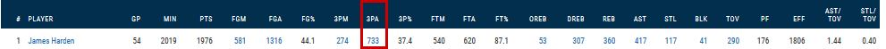
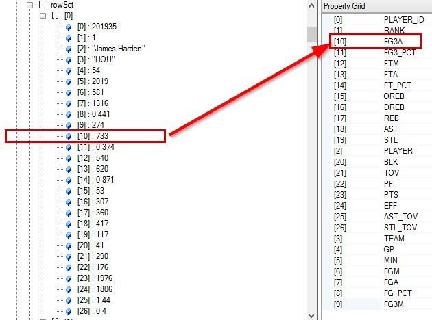

# Docu Tasks 001

En la web se muestra una tabla con la columna *3PA*.  

Sin embargo esa misma consulta a traves de la api devuelve el mismo valor con el nombre *FG3A*.  

**link**: https://stats.nba.com/help/glossary/#3pa

**3PA**  
Name:  3 Point Field Goals Attempted  
Definition:     The number of 3 point field goals that a player or team has attempted

